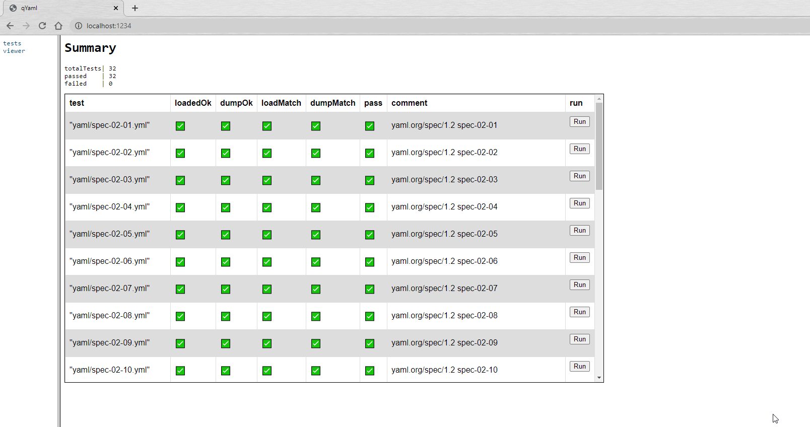
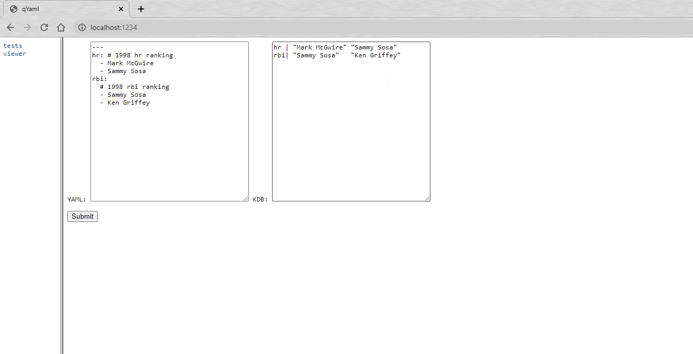

# qYaml - yaml parser for kdb+

## Overview

This script can be used to convert yaml documents to kdb+ objects.

We have followed the yaml 1.2 specification outlined [here](https://yaml.org/spec/1.2/spec.html).

## Usage

### Loading yaml

The main entry point is `.yml.load`. This can take a list of strings, which must be valid yaml, or a handle to a file containg yaml.

```
q).yml.load ("- abc"; "- def"; "- xyz")
"abc"
"def"
"xyz"
q)read0 `$"tests/yaml/spec-02-01.yml"
"- Mark McGwire"
"- Sammy Sosa"
"- Ken Griffey"
q).yml.load `$"tests/yaml/spec-02-01.yml"
"Mark McGwire"
"Sammy Sosa"
"Ken Griffey"
```

### Writing yaml

Use `.yml.dump` to write out a kdb object in simplified yaml format.

```
q).yml.dump 1 2 3
"- 1"
"- 2"
"- 3"
q)
q).yml.dump `a`b`c!1 2 3
"a: 1"
"b: 2"
"c: 3"
q)
q)
q)a 26
invoice | 34843
date    | 2001.01.23D00:00:00.000000000
bill-to | `given`family`address!("Chris";"Dumars";`lines`city`state`postal!("458 Walkman Dr.\nSuite #292\n";"Royal Oak";"MI";48046))
ship-to | `given`family`address!("Chris";"Dumars";`lines`city`state`postal!("458 Walkman Dr.\nSuite #292\n";"Royal Oak";"MI";48046))
product | +`sku`quantity`description`price!(("BL394D";"BL4438H");4 1;("Basketball";"Super Hoop");450 2392f)
tax     | 251.42
total   | 4443.52
comments| "Late afternoon is best. Backup contact is Nancy Billsmer @ 338-4338."
q)
q)
q).yml.dump a 26
"invoice: 34843"
"date: 2001-01-23T00:00:00.000000000"
"bill-to: "
"  given: Chris"
"  family: Dumars"
"  address: "
"      lines: '458 Walkman Dr.\nSuite #292\n'"
"      city: Royal Oak"
"      state: MI"
"      postal: 48046"
"ship-to: "
"  given: Chris"
"  family: Dumars"
"  address: "
"      lines: '458 Walkman Dr.\nSuite #292\n'"
"      city: Royal Oak"
"      state: MI"
"      postal: 48046"
"product: "
"  - "
"      sku: 'BL394D'"
"      quantity: 4"
"      description: Basketball"
"      price: 450"
"  - "
"      sku: 'BL4438H'"
"      quantity: 1"
"      description: Super Hoop"
"      price: 2392"
"tax: 251.42"
"total: 4443.52"
"comments: 'Late afternoon is best. Backup contact is Nancy Billsmer @ 338-4338.'"
```

## Test cases

The test cases are based on the examples from the yaml spec page and are similar to the test cases used in [pyyaml](https://github.com/yaml/pyyaml).

The strategy for testing was as follows

1. Collect a number of sample yaml docs based on the examples on the spec page.
2. Convert them to json using standard yaml parsers (pyyaml and an [online parser](https://yaml-online-parser.appspot.com/)
3. Link each input yaml file to an output json file.
4. Load the yaml file into kdb with `.yml.load`
5. Load the json file into kdb with `.j.k`
6. Test equality

### Caveats

* Not everything maps 1-1 between yaml and json, 
* * all numbers in json are floats and yaml allows floats and ints
* * nulls in json are null floats, yaml nulls are converted to generic nulls
* * timestaps are iso formatted and don't convert back to kdb timestamps using `.j.k`
* Multiple yaml docs (separated by `---`) do not convert to json but we represent these as a list of the individual docs.

### Running tests

Use the `runTests.q` script to execute tests.

Use the `-run` flag to run on start up and print the results.

Use the `-debug` flag to break and step into test failures.

The test cases can also be viewed visually using a web browser.

## Browser

You can view test cases and test free form yaml to see how it will be represented in kdb using a web-browser.

Load the `runTests.q` script in a q session listening on a port and point your web browser to that process.





## TODO

- [x] Add `.yml.dump` functionality to write out yaml from kdb objects
- [ ] Handle parsing failures - at the minute, invalid yaml may load ok and give unexpected output
- [ ] Add more tests for edge cases
